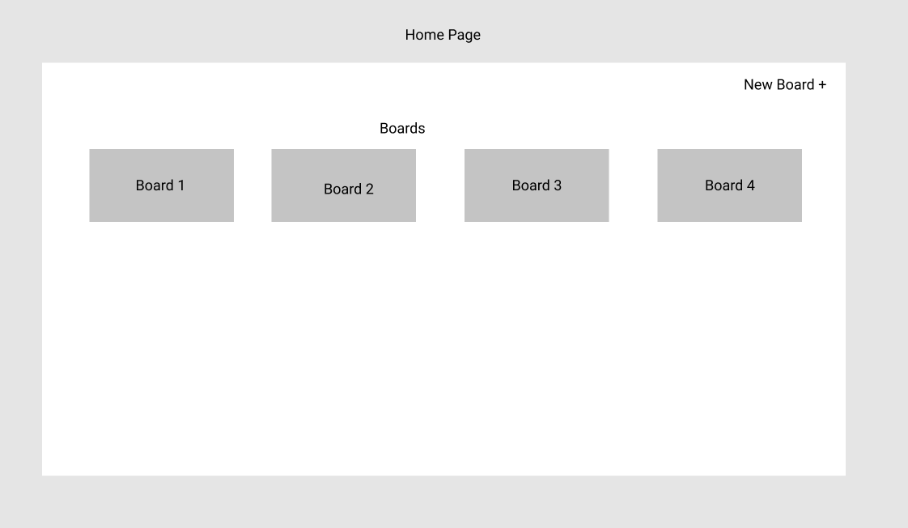
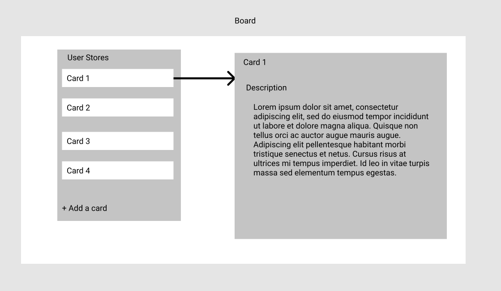
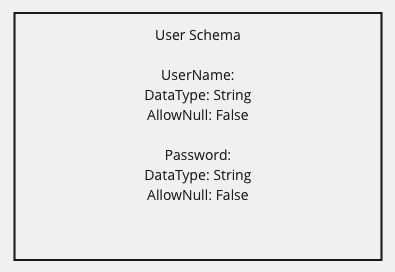
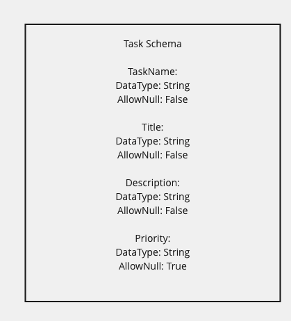

## HomePage



<br />

## Example Board



<br />

## DB Schema



<br />

## Task Schema



<br />

## User-Stories

```
User Story 1

User Story: As an Admin I want to be able to create, edit, delete, comment a users Tasks
Feature Tasks: Create a task, Comment on it, Edit, then Delete when completed
Acceptance Tests: Ensure Admin Picks correct selection and can move forward on the task selected

User Story 2

User Story: As an User I would like to have a profile to access  my projects
Feature Tasks:  Log in to a profile page to access projects
Acceptance Tests: Ensure that when authenticated user has access to profile projects


User Story 3
User Story: As a User I want to be able to move tasks to separate lists I have created
Feature Task: Drag a selected task to specific lists
Acceptance Tests: Ensure when task list is selected it can be drug accross page to another list.

User Story 4
User Story: As a User I want to be able to secure my work with authentication
Feature Task: Use auth0 to provide authentication
Acceptance Tests: User receives a token and token is verified

User Story 5
User Story: As a user I want to be able to invite coworkers so that I can assign them tasks
Feature Tasks: Invite user, assign task by user
Acceptance tests: Ensure a user can be added to the board, Ensure card can be assigned to a specific user


```
